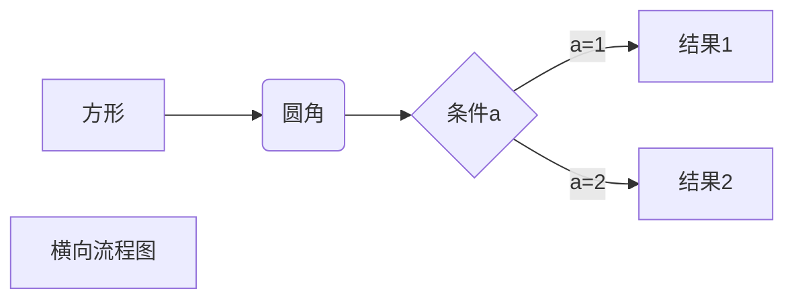
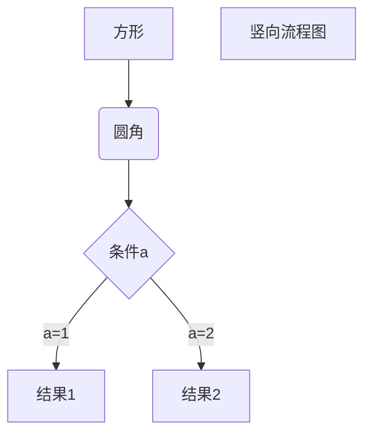

# 笔记

## mixin(混入)
    功能：可以把多个组件共用的配置提取成一个混入对象
    使用方式：
        第一步定义混合，例如：
            {
                data(){...}
                methods:{...}
                ...
            }
        第二部使用混入,例如：
            （1）.全部混入：Vue.mixin(xxx)
            （2）.局部混入：mixins:['xxx']

## 插件
    功能：用于增强Vue
    本质：包含install方法的一个对象，install的第一个参数是Vue,第二个以后的参数时插件使用者传递的数据
    定义插件：
        对象.install = function (Vue,options){
            //1.添加全局过滤器
            Vue.filter(...)

            //2.添加全局指令
            Vue.directive(...)

            //3.配置全局混入
            Vue.mixin(...)

            //4.添加实例方法
            Vue.prototype.$myMethod = function () {...}
            Vue.prototype.$myProperty = xxxx
        }

## scoped样式
    作用：让样式在局部生效，防止冲突
    写法：<style scoped>


## 总结TodoList案例
1.组件化编码流程

    (1).拆分静态组件：组件要按照功能点拆分，命名不要与html元素冲突
    (2).实现动态组件：考虑好数据的存放位置，数据是一个组件再用，还是一些组件再用：
        1). 一个组件再用：放在组件自身即可
        2).一些组件在用：放在他们共同的父组件上（状态提升）

    (3).实现交互：从绑定事件开始

2.pops适用于：
    (1).父组件 ===>子组件 通信
    (2).子组件 ===> 父组件 通信 (要求父先给子一个函数)

3.使用v-model时要切记：v-model绑定的值不能是pros传过来的值.因为props是不可以修改的！

4.props穿过来的若是对象类型的值，修改对象中的属性时Vue不会报错，但不推荐这样做

## webStorage
    1.储存内容大小一般支持5MB左右（不同浏览器可能还不一样）
    2.浏览器端通过Window.sessionStorage 和 Window.localStorage属性来实现本地储存机制
    3.相关API
        1.xxxxxStorage.setItem('key','value');
            该方法接受一个键和值作为参数，会把键值对添加到储存中，如果键名存在，则更新其对应的值
        2.xxxxxStorage.getItem('person')
            该方法接受一个键名作为参数，会把键值对添加到存储中，如果键名存在，则更新其对应的值
        3.xxxxxStorage.removeItem('key')
            该方法接受一个键名作为参数，并把该键名从储存中删除
        4.xxxxxStorage.clear()
            该方法会清空储存中的所有数据
    4.备注
        1.sessionStorage储存的内容会随着浏览器窗口关闭而消失
        2.LocalStorage储存的内容，需要手动清除才会消失。
        3.xxxxxStorage.getItem(xxx) 如果xxxx对应的value获取不到，那么getter的返回值是null.
        4.JSON.parse(null)的结果依然是null

## 组件的自定义事件
    1.一种组件间通信的方式，适用于： 子组件 ===>父组件
    2.使用场景：A是父组件，B是子组件 ,B给A传数据，那么就要在A中给B绑定自定义事件（事件的回调在A中)
    3.绑定自定义事件
        1.第一种方式，在父组件中：<Demo @atguigu="test" />或者<Demo v-on:atguigu="test" />
        2.第二种方式，在父组件中：
            <Demo ref="demo">
            ...
            mounted(){
                this.$refs.xxx.$on('atguigu',this.test)
            }
        3.若想让自定义事件只能触发一次，可以使用once修饰符，或$once方法
    4.触发自定义事件：this.$emit("atguigu",数据)
    5.解绑自定义事件：this.$off("atguigu")
    6.组件上也可以绑定原生DOM事件，需要使用native修饰符
    7.注意：通过this.$refs.xxx.$on("atguigu",回调)绑定自定义事件时，回调要么配置在methods中，要么使用箭头函数，否则this只想会出问题！

## 全局事件总线(GlobalEventBus)
    1.一种组件间通信的方式，适用于任意组件间通信
    2.安装全局事件总线：
        new Vue({
            ...
            beforeCreated(){
                Vue.prototype.$bus = this //安装全局事件总线，$bus就是当前应用的vm
            }
        })
    3.使用事件总线
        1.接受数据：A组件想接受数据，则在A组件中给$bus绑定自定义事件，事件的回调留在A组件自身
            methods(){
                demo(data){...}
            }
            ...
            mounted(){
                this.$bus.$on("xxxx",this.demo)
            }
        2.提供数据: this.$bus.$emit("xxxx",数据)
    4.最好在beforeDestroy钩子中，用$off去解绑当前组件所用到的事件

## 消息订阅与发布
    1.一种组件间通信的方式，适用于任意组件间通信
    2.使用步骤：
        1.安装: pubsub: npm i pubsub.js
        2.引入: import pubsub from "pubsub.js"
        3.接收数据：A组件想接收数据，则在A组件中订阅消息，订阅的回调留在A组件自身
            methods:{
                demo(data){...}
            }
            ...
            mounted(){
                this.pid = pubsub.subscribe("xxx",this.demo) //订阅消息
            }
        4.提供数据：pubsub.publish("xxx",数据)
        5.最好在beforeDestroy 钩子中，用pubsub.unsubscribe(pid) 去取消订阅

## nextTick
    1.语法：this.$nextTick(回调函数)
    2.作用：在下一次DOM更新结束后执行其指定的回调
    3.什么时候用：当改变数据后，要基于更新后的新DOM进行某些操作时，要在nextTick所指定的回调函数中执行

## Vue封装的过度与动画
    1.作用：在插入，更新或者一处DOM元素时，在合适的时候给元素添加样式类名
    2.图示：
        Enter                                Leave
    opacity:0 -----> opacity:1  opacity:1 -----> opacity:0
        |               |           |                |
        |               |           |                |
    v-enter          v-enter-to v-leave          v-leave-to
    |                   |           |                       |
    |___________________|           |_______________________|
            |                               |
        v-enter-active                  v-leave-active

    3.写法
        1.准备好样式：
            .元素进入的样式
                1.v-enter:          进入的起点
                2.v-enter-active:   进入过程中
                3.v-enter-to:       进入的终点
            .元素离开的样式
                1.v-leave:          离开的起点
                2.v-leave-active:   离开的过程中
                3.v-leave-to:       离开的终点
            
        2.使用<transition>包裹要过度的元素，并配置name属性
            <transition name="value">
                <h1 v-show="isShow">Hello!</h1>
            </transition>

        3.备注：若有多个元素需要过度，则需要使用：<transition-group>,且每个元素都要指定key值

## 脚手架配置代理
- 方法一
  - 在vue.config.js中添加如下*配置*:
    - devServer:[  
                proxy:"http://localhost:5000"  
              ]
        说明：
            1.有限：配置简单，请求资源时直接发给前段（8080）即可
            2.缺点：不能配置等多个代理，不能灵活的控制请求是否走代理
            3.工作方式：若按照上述配置代理，当请求了前端不存在的资源时，那么该请求会转发给服务器（有限匹配前端资源）
        
    方法二
        编写vue.config.js配置具体代理规则
            module.exports = {
                devServer: {
                    proxy: {
                        '/api' : {//匹配所有以 '/api' 开头的请求路径
                            target: 'http://localhost:5000',//代理目标的基础路径
                            changeOrigin: true,
                            pathRewrite: {'^/api',''}
                        },
                        '/api2' : {//匹配所有以 '/api2' 开头的请求路径
                            target: 'http://localhost:5001',//代理目标的基础路径
                            changeOrigin: true,
                            pathRewrite: {'^/api2',''}
                        },
                    }
                }
            }
            /*
                changeOrigin设置为true时，服务器收到的请求头中的host为: localhost:5000
                changeOrigin设置为false时，服务器收到的请求头中的host为: localhost:8080
                changeOrigin默认值是 true
            */
        
        说明：
            1.优点：可以配置多个代理，且可以灵活的控制请求是否走代理。
            2.缺点：配置略微繁琐，请求资源时必须加前缀。  

## 插槽
    1. 作用：让父组件可以向子组件指定位置插入html结构,也是一种组件间通信的方式,适用于父组件===>子组件
    2. 分类：默认插槽、具名插槽、作用域插槽
    3. 使用方式
       1. 默认插槽  
            ```HTML
            父组件中：
                <Category>
                    <div>html结构</div>
                </Categoy>
            子组件中:
                <template>
                    <div>
                        <!-- 定义插槽-->
                        <slot>插槽默认内容</slot>
                    </div>
                </template>
            ```
        2. 具名插槽
            ```HTML
            父组件中：
                <Category>
                    <template slot="center">
                        <div>Html结构1</div>
                    </template>

                    <template v-slot:footer>
                        <div>Html结构2</div>
                    </template>
                </Category>
            子组件中：
                <template>
                    <div>
                        <!--定义插槽-->
                        <slot name="center">插槽默认内容</slot>
                        <slot name="footer">插槽默认内容</slot>
                    </div>
                </template>
            ```
        3. 作用域插槽
           1. 理解：<span style="color:red">数据在组件的自身，但根据数据生成的结构需要组件的使用者来决定。</span>(games 数据在Category组件中，但是用数据所遍历出来的结构由APP组件jueding )
           2. 具体编码
            ```HTML 
            父组件中:
                <Category>
                    <template scope = 'scopeData'>
                        <!-- 生成的是ul列表  -->
                        <ul>
                            <li v-for="g in scopeData.games" :key="g">{{g}}</li>
                        </ul>
                    </template>
                </Category>
            子组件中:
                <template>
                    <div>
                        <slot :games = "games"></slot>
                    </div>
                </template>
            
                <scirpt> 
                    export default{
                        name:'Category',
                        props:['title'],
                        //数据在子组件自身
                        data(){
                            return{
                                games:['红色警戒','穿越火线','劲舞团','超级玛丽']
                            }
                        }
                    }
                </script>
            ```
            3. 注意：作用域插槽也可以有name属性
        
## Vuex
### 1. 概念
- 在Vue中实现集中式状态(数据)管理的一个Vue插件，对Vue应用中多个组件的共享状态进行集中式的管理（读/写），也是一种组件间通信的方式，且适用于任意组件间通信
### 2. 何时使用
- 多个组件需要共享数据时
### 3. 搭建vuex环境
1. 创建文件:<span style="background-color:#ddd;margin:0px 10px;padding:0px 5px">src/store/index.js</span>
   ```javascript
    //引入Vue核心库
    import Vue from 'vue'
    //引入Vuex
    import Vuex from 'vuex'
    //应用Vuex插件
    Vue.use(Vuex)

    //准备actions对象--响应组件中用户的动作
    const actions ={}
    //准备mutations对象--修改state中的数据
    const mutations ={}
    //准备state对象--保存具体的数据
    const state={}

    //创建并暴露store
    export default new Vuex.Store({
        actions,
        mutations,
        state,
    })
   ```
2. 在<span style="background-color:#ddd;margin:0px 10px;padding:0px 5px">main.js</span>中创建vm时传入<span style="background-color:#ddd;margin:0px 10px;padding:0px 5px">store</span>配置项
   ```javascript
    ......
    //引入store
    import store from './store/index.js'
    ......

    //创建vm
    new Vue({
        el:'#app',
        render : h => h(App),
        store:store;//简写：store
    })
   ```

3. 基本使用
   1. 初始化数据，配置`actions`、配置`mutations`,操作文件`store.js`
    ```javascript
        //引入Vue核心库
        import Vue from 'vue'
        //引入Vuex
        import Vuex from 'vuex'
        //引用Vuex
        Vue.use(Vuex)

        const actions = {
            //响应组件中加的动作
            jia(contest,value){
                // console.log('actions中的jia被调用了',context,value)
                contest.commit('JIA',value)
            }
        }

        const mutations = {
            //执行加
            JIA(state,value){
                //console.log('mutaions中的JIA被调用',state,value)
                state.sum = value
            },
        }

        const state = {
            sum : 0,
        }

        //创建并暴露store
        export default new Vuex.Store({
            actions,
            mutations,
            state
        })
    ```
    2. 组件中读取vuex中的数据:`$store.state.sum`
    3. 组件中修改vuex中的数据:`$store.dispatch('action中的方法名',数据)`或`$store.commit('mutations中的方法名',数据)`
    **备注:若没有网络请求或其他业务逻辑，组件中也可以越过actions，即不写`dispatch`，直接编写`commit`**
4. getters的使用
   1. 概念：当`state`中的数据需要经过加工后再使用时,可以使用getter加工
   2. 在`store.js`中追加`getters`配置
      ```javascript
        ......

        const getters = {
            bigSum (state){
                return state.sum * 10
            }
        }

        //创建并暴露store
        export default new Vuex.Store({
            ......
            getters
        })
      ```
    3. 组件中读取数据：`$store.getters.bigSum`
5. 四个map方法的使用
    1. **mapState方法:**用于帮助我们映射`state`中的数据为计算属性
        ```javascript
            computed:{
                //借助mapState生成计算属性: sum , school , subject(对象写法)
                ...mapState({sum:'sum',school:'school',subject:'subject'}),

                //借助mapState生成计算属性：sum , school , subject(数组写法)
                ...mapState(['sum','school','subject']),
            },
        ```
    2. **mapGetters方法:**用于帮助我们映射`getters`中的数据为计算属性
        ```javascript
            computed:{
                //借助mapGetters 生成计算属性：bigSum(对象写法)
                ...mapGetters({bigSum:'bigSum'}),

                //借助mapGetters 生成计算属性：bigSum(数组写法)
                ...mapGetters({'bigSum'})
            },
        ```
    3. **mapActions方法：**用于帮助我们生成与`actions`对话的方法，即：包含`$store.dispatch(xxx)`的函数
        ```javascript
            methods:{
                //靠mapActions生成：incrementOdd , incrementWait(对象形式)
                ...mapActions({incrementOdd:'jiaOdd',incrementWait:'jiaWait'})

                //靠mapActions生成：incrementOdd , incrementWait (数组形式)
                ...mapActions({'jiaOdd','jiaWait'})
            }
        ```
    4. **mapMutations方法:**用于帮助我们生成与`mutations`对话的方法，即包含`$store.commit(xxx)`的函数
        ```javascript
            methods:{
                //靠mapAction生成：increment , decrement (对象形式)
                ...mapMutations({increment:'JIA',decrement:'JIAN'}),

                //靠mapMutations生成,JIA , JIAN(对象形式)
                ...mapMutations({'JIA','JIAN'})
            }
        ```
    **备注：mapActions与mapMutations使用时，若需要传递参数需要：在模板中板顶事件时传递好参数,否则参数时是事件对象**

## 模块化命名空间
1. 目的：让代码更好维护，让多种数据分类更加明确
2. 修改`store.js`
   ```javascript
    const countAbout = {
        namespaced:true,    //开启命名空间
        state:{x:1},
        mutations:{...},
        actions:{...},
        getters:{
            bigSum(state){
                return state.sum*10
            }
        }
    }

    const personAbout = {
        namespaced:true, //开启命名空间
        state:{...},
        mutations:{...}
        actions:{...}
    }

    const store = new Vuex.Store({
        modules:{
            countAbout:countAbout,
            personAbout:personAbout,
        }
    })
   ```
3. 开启命名空间后，组件读取state数据：
   ```javascript
    //方式一: 自己直接读取
    this.$store.state.personAbout.list
    //方式二: 借助mapState读取
    ...mapState('countAbout',['sum','school','subject']),
   ```
4. 开启命名空间后，组件中读取getters数据：
   ```javascript
    //方式一: 自己直接读取
    this.$store.getters['personAbout/firstPersonName']
    //方式二: 借助mapGetters读取
    ...mapGetters('countAbout',['bigNum']),
   ```
5. 开启命名空间后，组件中调用dispatch
   ```javascript
    //方式一: 自己直接dispatch
    this.$store.dispatch('personAbout/addPersonWang',person)
    //方式二: 借助mapActions:
    ...mapActions('coutAbout',{incrementOdd:'jiaOdd',incrementWait:'jiaWait'})
   ```
6. 开启命名空间后，组件中调用commit
   ```javascript
    //方式一: 自己直接commit
    this.$store.commit('personAbout/ADD_PERSON',person)
    //方式二: 借助mapMutations
    ...mapMutations('countAbout',{increment:'JIA',decrement:'JIAN'}),
   ```
## 路由
---
    1. 理解：一个路由(router) 就是一组映射关系(key-value), 多个路由需要路由器(router)进行管理
    2. 前端路由: key 是路径,value是组件
1. 基本使用
   1. 安装vue-router ,命令:npm i vue-router
   2. 应用插件: Vue.use(vueRouter)
   3. 编写router配置项
       ```javascript
        //引入VueRouter
        import VueRouter from 'vue-router'
        //引入路由组件
        import About from '../components/About'
        import Home from '../components/Home'

        //创建router实例对象，去管理一组一组的路由规则
        const router = new VueRouter({
            routes:[
                {
                    path:'/about',
                    component:About
                },
                {
                    path:'home',
                    component:Home
                }
            ]
        })

        //暴露router
        export default router
      ```
    4. 实现切换(active-class可配置高亮样式)
       `<router-link active-class="active" to="/about">About</router-link>`
    5. 指定展示位置
       `<router-view></router-view>`
2. 几个注意点
   1. 路由组件通常存放在pages文件夹,一般组件通常存放在components文件夹。
   2. 通过切换，“隐藏”了的路由组件，默认是被销毁掉的，需要的时候再去挂载
   3. 每个组件都有自己的`$route`属性，里面储存这自己的路由信息
   4. 整个应用只有一个router,可以通过组件的`$router`属性获取到
3. 多级路由(嵌套路由)
   1. 配置路由规则，shiyong children配置项
      ```javascript
        routes:[
            {
                path:'/about',
                component:About
            },
            {
                path:'/home',
                component:Home,
                children:[//通过children配置子路由
                    {
                        path:'news',//此处不能写'/news'
                        component:News
                    },
                    {
                        path:'message',//此处不能写'/message'
                        component:Message
                    }
                ]
            }
        ]
      ```
    2. 跳转(要写完整路径)
       `<router-link to="/home/news">News<router-link>`
4. 路由的query参数
   1. 传递参数
     ```html
    <!-- 跳转并携带query参数，to的字符串写法 -->
    <router-link :to="`/home/message/detail?id=666&title=你好`">跳转</router-link>

    <!-- 跳转并写法query参数，to的对象写法 -->
    <router-link :to"{
        path:'/home/message/detail',
        query:{
            id:666,
            title:'你好'
        }
    }">
        跳转
    </router-link>
     ```
   2. 接受参数
     ```javascript
        $route.query.id
        $route.query.title
     ```
5. 命名路由
   1. 作用：简化路由的跳转
   2. 如何使用
      1. 给路由命名
      ```javascript
      {
          path:'/demo',
          component:Demo,
          children:[
              {
                  path:'test',
                  component:Test,
                  children:[
                      {
                          name:'Hello', //给路由命名
                          path:'welcome',
                          component:Hello
                      }
                  ]
              }
          ]
      }
      ```
      2. 简化跳转:
      ```html
        <!-- 简化前，需要写完整的路径 -->
        <router-link to="/demo/test/welcome">跳转</router-link>

        <!-- 简化后，直接通过名字跳转 -->
        <router-link :to="{name:'hello'}">跳转</router-link>

        <!-- 简化写法配合传递参数 -->
        <router-link
            :to="{
                name:'hello',
                query:{
                    id:666,
                    title:'你好'
                }
            }"  
        >跳转</router-link>
      ```
6. 路由的params参数
   1. 配置路由，声明接受params参数
      ```javascript
      {
          path:'/home',
          component:Home,
          children:[
              {
                  path:'/message',
                  component:Message,
                  children:[
                      {
                          name:'xiangqing',
                          path:'detail/:id/:title', //使用占位符声明接受params参数
                          component:Detail
                      }
                  ]
              }
          ]
      }
      ```
   2. 传递参数
      ```html
        <!-- 跳转并携带params参数，to的字符串写法 -->
        <routeer-link :to="/home/message/detail/666/你好">跳转</router-link>

        <!-- 跳转并携带params参数，to的对象写法 -->
        <router-link
            :to="{
                name:'xiangqing',
                params:{
                    id:666,
                    title:'你好啊'，
                }
            }"
        >跳转</router-link>
      ```
      **特别注意：路由携带params参数时，使用to的对象写法，则不能使用path配置项，必须使用name配置!!!**
7. 路由的props配置
   1. 作用：让路由组件更方便的收到参数
   ```javascript
    {
        name:'xiangqing',
        path:'detail/:id',
        component:Detail,

        //第一种写法,props值为对象,该对象中的所有key-value的组合最终都会通过props传给Detail组件
        props:{a:900}

        //第二种写法, props值为布尔值,布尔值为true,则把路由收到的params参数通过props传给Detail组件
        props:true

        //第三种写法,props值为函数，该函数返回的对象中每一组的key-value都会通过props传给Detail组件
        props($route){
            return {
                id:$route.query.id,
                title:$route.query.title,
            }
        }
    }

   ```
8. `<router-link>`的replace属性
   1. 作用：控制路由跳转时操作浏览器历史记录的模式
   2. 浏览器的历史记录有两种写入方式：分别为`push`和`replace`,`push`是追加历史记录，`replace`是替换当前记录。路由跳转时候默认为`push`
   3. 如何开启`replace`模式：`<router-link replace ......>News</router-link>`
9. 编程式路由导航
   1.  作用：不借助`<router-link>`实现路由跳转，让路由跳转更加灵活
   2.  具体编码
    ```javascript
    //$router的两个API
    this.$router.push({
        name:'xiangqing',
        params:{
            id:xxx,
            title:xxx,
        }
    })

    this.$router.replace({
        name:'xiangqing',
        params:{
            id:xxx,
            title:xxx
        }
    })

    this.$router.back()

    this.$router.forward()

    this.$router.go()
    ```
10. 缓存路由组件
    1.  作用：让不展示的路由组件保持挂载，不被销毁
    2.  具体编码：
    ```html
    <!-- 这里的News，是指的组件里面的名字name -->
    <keep-alive include="News">
        <router-view></router-view>
    </keep-alive>

    <!-- 多个的写法 -->
    <keep-alive :include="['News','Message']">
        <router-view></router-view>
    </keep-alive>
    ```
11. 两个新的生命周期钩子
    1.  作用: 路由组件所独有的两个钩子，用于补货路由组件的激活状态
    2.  具体名字
        1.  `activated`路由组件被激活时触发
        2.  `deactivated`路由组件失活时触发
12. 路由守卫
    1.  作用：对路由进行权限控制
    2.  分类：全局守卫、独享守卫、组件内守卫
    3.  全局守卫
    ```javascript
    //全局前置守卫，初始化时执行，每次路由切换前执行
    router.beforeEach((to,from,next)=>{
        console.log("beforeEach",to,from)
        if(to.meta.isAuth){//判断当前路由是否需要进行权限控制
            if(localStorage.getItem('school') === 'atguigu'){//权限控制的具体规则
                next() //放行
            }else{
                alert('暂无权限查看')
            }
        }else{
            next()  //放行
        }
    })

    //全局后置守卫，初始化时执行，每次路由切换后执行
    router.afterEach((to,from,next)=>{
        console.log("afterEach",to,from)
        if(to.meta.title){
            document.title = "to.meta.title" // 修改网页的title
        }else{
            document.title = 'vue_test'
        }
    })
    ```
    4. 独享守卫
    ```javascript
    beforeEnter(to,from,next){
        console.log("beforeEnter",to,from)
        if(to.meta.isAuth){//判断当前路由是否需要进行权限控制
            if(localStorage.getItem('school') === 'atguigu'){
                next()
            }else{
                alert('暂无权限查看')
            }
        }else{
            next()
        }
    }
    ```
    5. 组件内守卫
    ```js
    //进入守卫：通过路由规则进入该组件时被调用
    beforeRouteEnter(to,from,next){
        next()
    },
    //离开守卫：通过路由规则离开该组件时被调用
    beforeRouteLeave(to,from,next){
        next()
    }
    ```
13. 路由器的两种工作模式
    1.  对于一个`url`李硕，什么事hash值？------#及其后面的内容就是hash值
    2.  hash值不会包含在HTTP请求中，即：hash值不会带给服务器
    3.  hash模式：
        1.  地址中永远带着/#/号，不美观
        2.  若以后将地址通过第三方app分享，若app校验严格，则地址会被标记为不合法
        3.  兼容性较好
    4.  history模式
        1.  地址干净，美观。
        2.  兼容性和hash模式相比略差
        3.  应用部署上线需要后端人员支持，解决刷新页面服务器404问题

## 关于Vue ui的使用
1. 常用的移动端UI组件库
   1. Vant <https://youzan.github.io/vant>
   2. Cube UI <https://didi.github.io/cube-ui>
   3. Mint UI <http://mint-ui.github.io>
2. PC端常用的UI组件库
   1. Element UI <https://element.eleme.cn>
   2. IView UI <https://www.iviewui.com>
## 关于如何使用markdown文本标记语言  
***
- 二级标题
- 特殊的文本格式
  - *斜体*
  - _斜体_
  - **粗体**
  - __粗体__
  - ***粗斜体***
  - ___粗斜体___
  - ~~删除线~~
  - <u>下划线</u>
  - 脚注文本 [^注明的文本]
  - [^AVC]:  yes

- markdown列表
  - 无序列表
    * 1
    * 2
    * 3
    * 4
  - 有序列表
    1. text
    2. text
    3. text
    4. text
   - 列表嵌套
    1. title
       * text
       * text
       * text
    2. title
       * text 
       * text
       * text
- markdown区块
  - 区块引用是在段落开头使用 > 符号 ，然后后面紧跟一个空格符号
    > block use
    > more and more moremoremoreomroemomroemreo
    > more and more moremoremoreomroemomroemreo
  - 区块也是可以嵌套的
    > block one 
    >> block two
    >>> block three

- 数学表达式
  - $f(x)=sin(x)+15$
  - $f(2x^2+26)=\{x=6 \| x=a^3b^2\}$

$$
    \begin{Bmatrix}
        a & b \\
        c & d
    \end{Bmatrix}
$$
$$
\begin{CD}
    A @>a >>B \\
    @ VbVV @AAcA \\
    c @= D
\end{CD}
$$



<br/>
<br/>
<br/>
<br/>
<br/>



```flow
st=>start: 开始框
op=>operation: 处理框
cond=>condition: 判断框(是或否?)
sub1=>subroutine: 子流程
io=>inputoutput: 输入输出框
e=>end: 结束框
st->op->cond
cond(yes)->io->e
cond(no)->sub1(right)->op
```


```flow
st=>start: 开始框
op=>operation: 处理框
cond=>condition: 判断框(是或否?)
sub1=>subroutine: 子流程
io=>inputoutput: 输入输出框
e=>end: 结束框
st(right)->op(right)->cond
cond(yes)->io(bottom)->e
cond(no)->sub1(right)->op
```

119